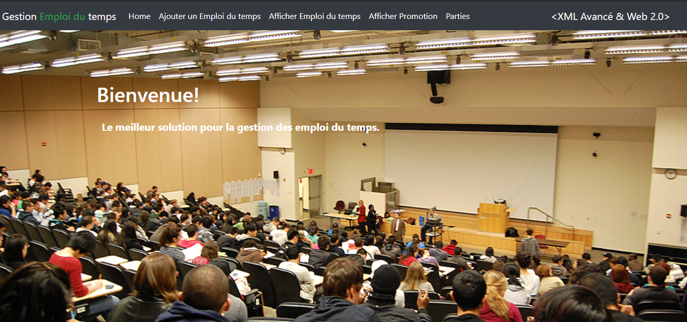
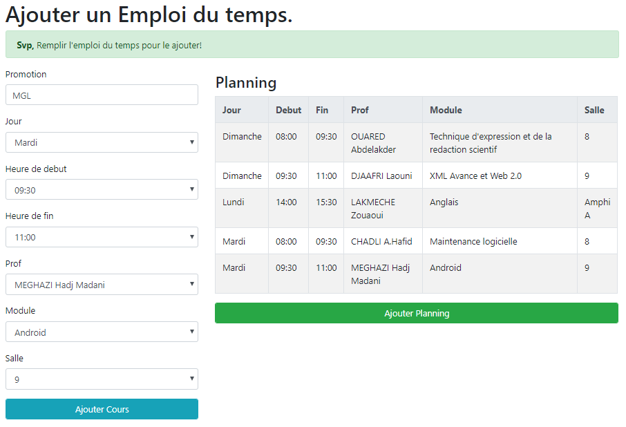
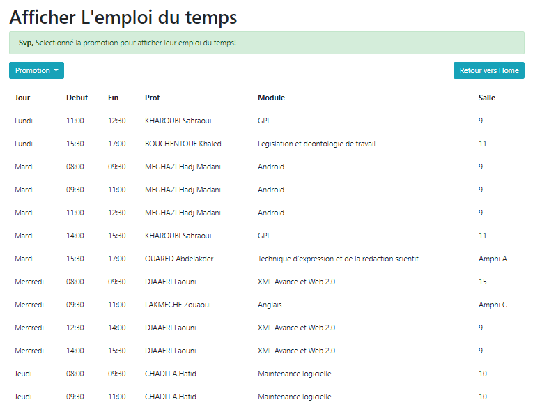
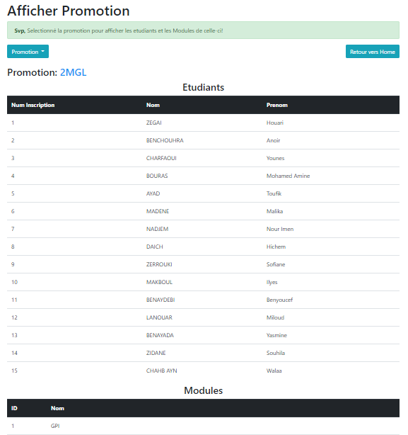
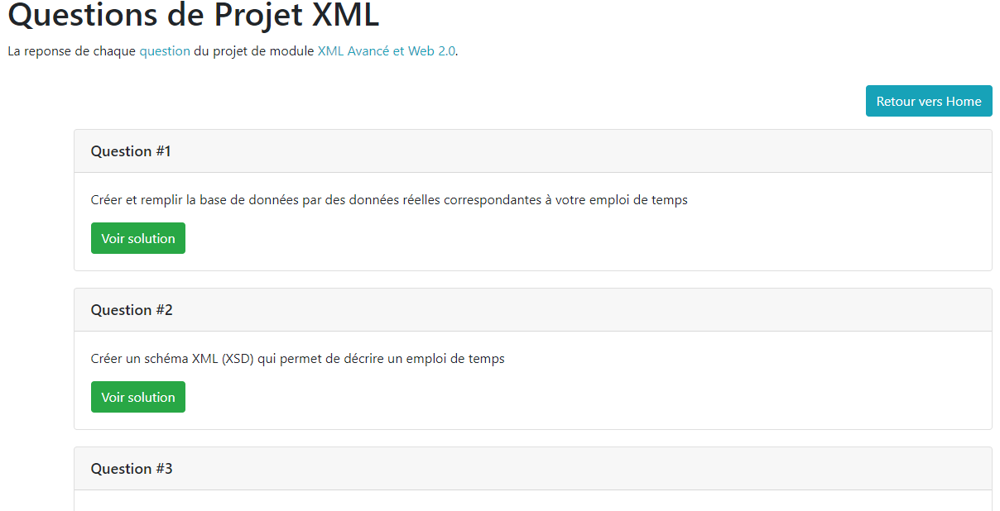
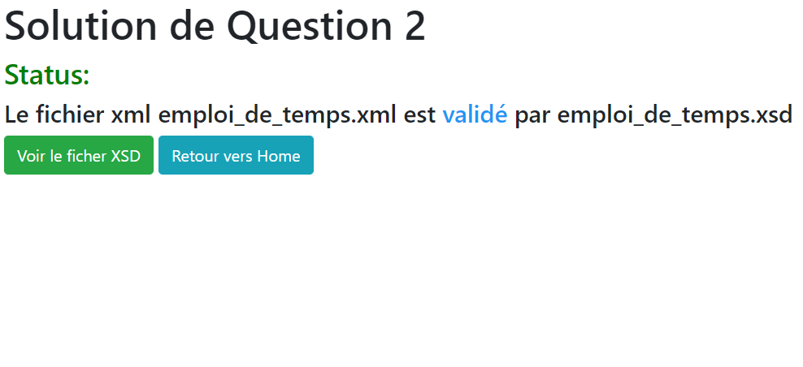

# University Scheduling Management System 🎉
**FR**: Gestion d'emploie du temps

## Screenshots
### Screenshoot
Home           |
:---------------------:|
 |
Add Planning |

View Planning           |

View Promotion |

(Q/A) Parts           |

Solution of Question 2 |

## Languages, Technologies & Libraries used 🔧
* HTML
* CSS & Bootstrap
* Javascript & Ajax
* PHP
* XML, XSLT, XSD
* MySQL (Database)

## Contributing 💡
If you want to contribute to this project and make it better with new ideas, your pull request is very welcomed.
If you find any issue just put it in the repository issue section, thank you.
